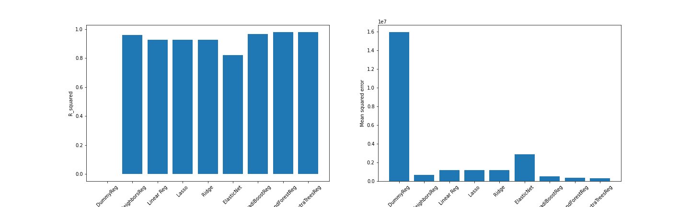

## ih_datamadpt0420_project_m3

# Find the algorithm to predict diamond prices (regression model, ML)

In the second Project the dataset Diamonds with about 40 000 samples was described statistically. On basis of this data in the third Project a prediction model is developed to predict prices. 

It is a supervised learning as the data is labeld. Furthermore a regression model is needed as the output variable (the price of the diamond) is numeric and continuous. 

In the following steps the development of the model is described. The coding of each step can be found in the respective Jupyter Notebook file. 

**1) Choose_Regression_Model.ipynp

The dataset contains numerical and categorical data. To make the data usable for the ML algorithms the numerical data are standarized with the standard scaler and the categorical data are encoded with onehot encoder. 

After the preprocessing of the data an effective regression algorithm is searched. Therefore the R² value and the mean squared error of the following logarithm are compared: 

	KneighborsRegressor,
	LinearRegression,
	Lasso,
	Ridge,
	ElasticNet,
	GradientBoostingRegressor,
	RandomForestRegressor,
	ExtraTreesRegressor

From the picture it can be seen, that Random Forest and Extra Trees Regressor have the highest R² and the lowest mean squared error value. Therefore in the next step, the Hyperparameters of Random Forest shall be optimized and the stability of the algorithm is tested. This is done with cross validation.

**2) Build_a_stacking_model.iypnp

In the second step it is checked if the prediction model can be improved by combining several algorithm. Therefore the stacking model is used. The following algorithms were used as estimators 
(level0):

    ExtraTreesRegressor
    DecisionTreeRegressor
    KNeighborsRegresso
    SVR
    RandomForestRegressor
    GradientBoostingRegressor

as final estimator (level1) is used: 

    LinearRegression()

In the stacked model in cannot be seen an improvement in prediction compared to the model using the random forest algorithm. 

Further optimizaton of the prediction models can be reached with Feature Engeneering of the variables which is not covered in this project. 
